<h1 align="center">논문 데일리 · Daily Papers</h1>

<p align="center">
  
</p>

<p align="center">
  <b>매일 아침, 관심 분야 논문 다섯 편.</b><br/>
  <sub>A daily research-paper reader for grad students & researchers · 한국어 / English</sub>
</p>

<p align="center">
  
  
  
  
</p>

---

<p align="center">
  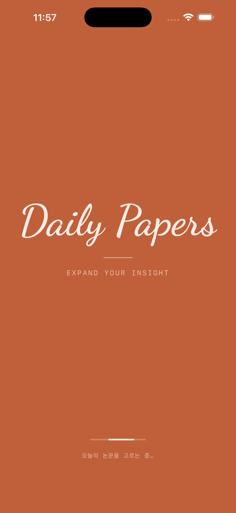
  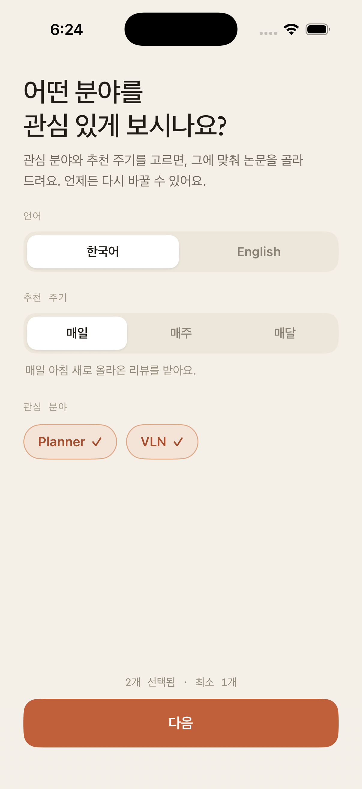
  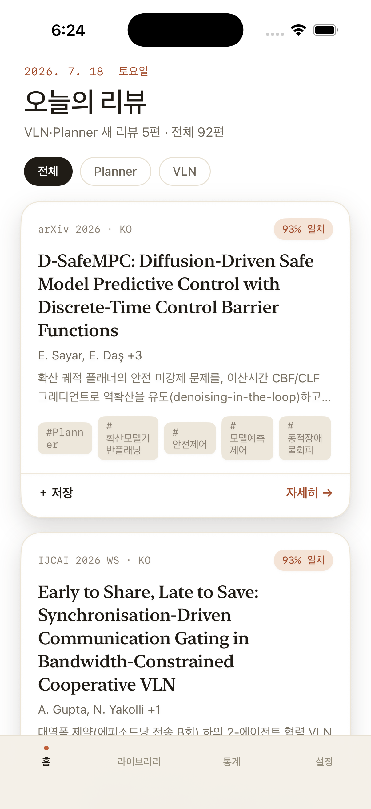
  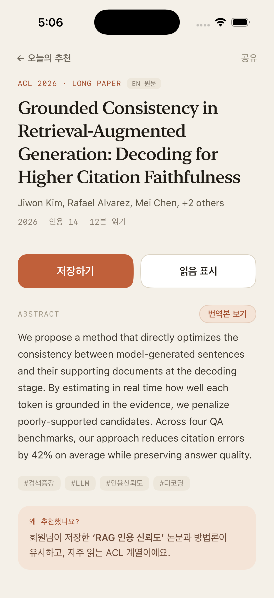
</p>
<p align="center">
  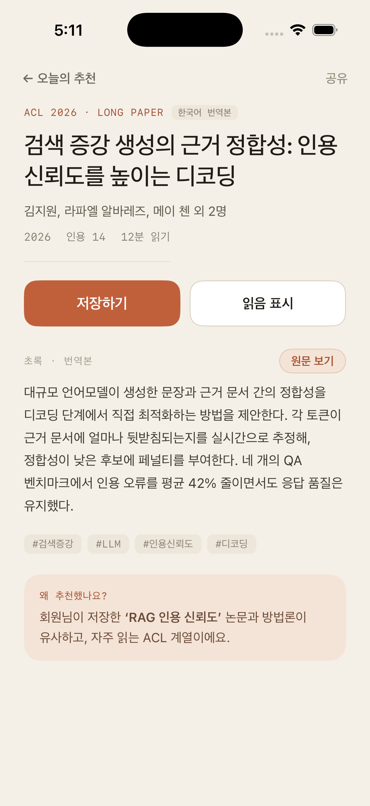
  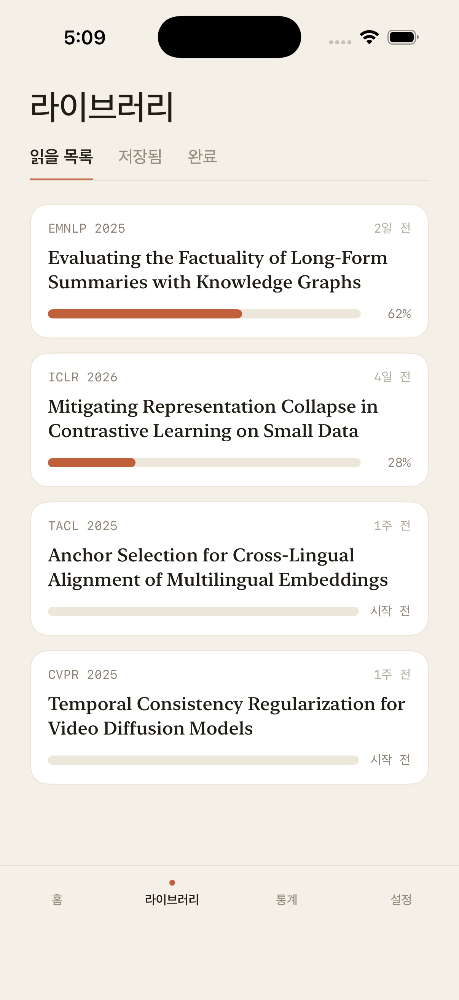
  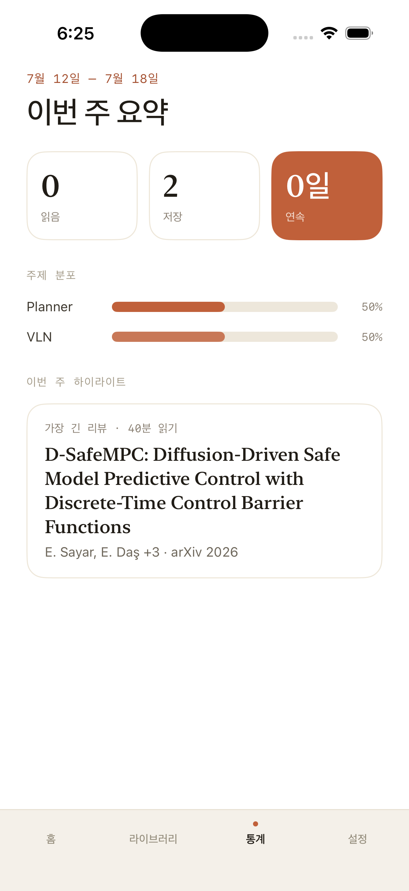
  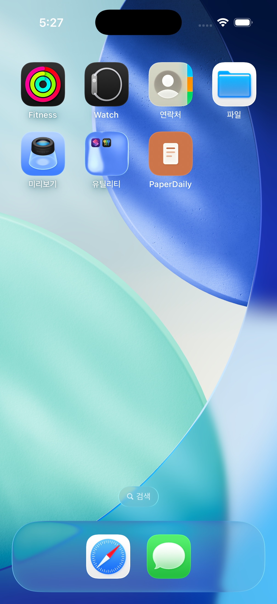
</p>

## ✨ Features

|   |   |
|---|---|
| 🎯 **맞춤 추천** | 온보딩에서 고른 관심 분야로 데일리 피드를 필터링 |
| 📄 **리뷰 리더** | 에이전트가 쓴 장문(40~80KB) 한국어 리뷰를 앱에서 정독 |
| 🌐 **원문 ↔ 번역** | 번역본이 있는 논문은 원문 ↔ 한국어 토글 |
| 🇰🇷 / 🇺🇸 **한 · 영 UI** | 앱 전체 언어 전환 (온보딩 · 설정) |
| 📚 **라이브러리** | 읽을 목록 · 저장 · 완료 |
| 📊 **주간 요약** | 이번 주 읽음 · 저장 · 연속 일수 · 주제 분포 |

## 📄 리뷰 리더

피드의 논문마다 **에이전트가 작성한 PhD 수준의 한국어 리뷰**가 붙습니다. 목차·읽기 진행률·섹션
네비게이션, 수식 렌더링, 표·그림·아키텍처 다이어그램 트리트먼트를 갖춘 전용 리더로 읽습니다.

<p align="center">
  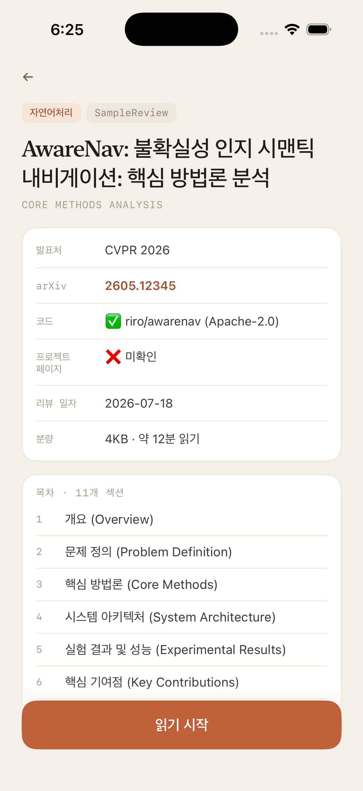
  &nbsp;&nbsp;
  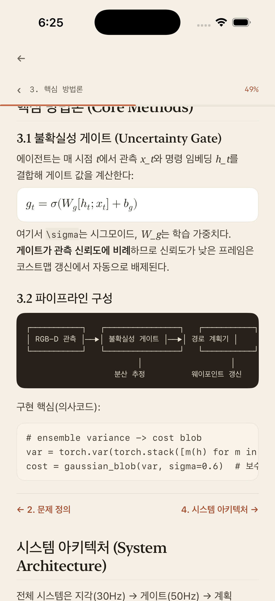
</p>

> 위 두 화면은 **네이티브 리더**(MarkdownUI + SwiftMath)이며, 번들된 샘플 리뷰로 시연한 것입니다.
> 피드가 `reviewMarkdownURL` 필드를 내보내기 전까지는 앱이 [웹 리뷰 페이지](https://romaster93.github.io/paperdaily-feed/)를
> 리더 안에서 띄우고, 필드가 생기면 자동으로 네이티브 리더로 전환됩니다.

## 🔄 어떻게 동작하나

```
paper-review 에이전트        피드 생성기              GitHub Pages            앱
(매일 새벽, arXiv 탐색)  →  (review.md → HTML   →   daily.json +      →   fetch
 PhD 수준 한국어 리뷰         + daily.json)          리뷰 페이지            (실패 시 캐시 → 샘플)
```

앱은 하루치 배치(`papers`)만 피드에 보여주고, 나머지 코퍼스(`archive`)는 저장·읽음 목록을
해석하는 데만 씁니다. 스키마는 [`daily.schema.md`](PaperDaily/Backend/daily.schema.md),
리뷰 마크다운 계약은 [`REVIEW-FORMAT.md`](REVIEW-FORMAT.md) 참고.

## 🌐 한국어 · English

<p align="center">
  
  &nbsp;&nbsp;
  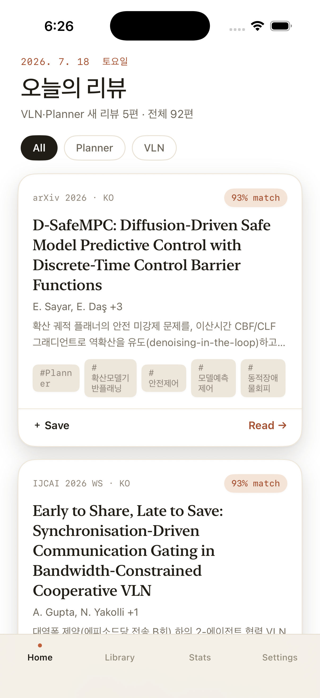
</p>

## 🛠 Built with

<p align="center">
  <code>SwiftUI</code> · <code>iOS 17+</code> ·
  <code>MarkdownUI</code> · <code>SwiftMath</code> ·
  Mac Mini <code>daily.json</code> feed · Dancing Script wordmark
</p>

---

## © Copyright & License

**© 2026 romaster93 · All Rights Reserved.**

이 저장소의 소스 코드·디자인·에셋은 저작권자(**romaster93**)의 자산입니다. 열람은 허용되나, **사전 서면 허가 없이 복제·수정·재배포·상업적 이용을 금합니다.** 전문은 [`LICENSE`](LICENSE) 참고.

### Third-party notices
- **Dancing Script** — 스플래시 워드마크 폰트. © The Dancing Script Project Authors, [SIL Open Font License 1.1](PaperDaily/PaperDaily/DancingScript-OFL.txt). *위 프로젝트 라이선스와 별개로, 이 폰트는 OFL을 따릅니다.*
- **swift-markdown-ui** — 리뷰 마크다운 렌더링. © Guillermo Gonzalez, MIT License.
- **SwiftMath** — 리뷰 수식 렌더링. © 2023 Computer Inspirations, MIT License.

### Docs
[`DESIGN.md`](DESIGN.md) · [`REVIEW-FORMAT.md`](REVIEW-FORMAT.md) · [`DEV_NOTES.md`](DEV_NOTES.md) · [`PaperDaily/README.md`](PaperDaily/README.md) · [`PaperDaily/RELEASE.md`](PaperDaily/RELEASE.md)
